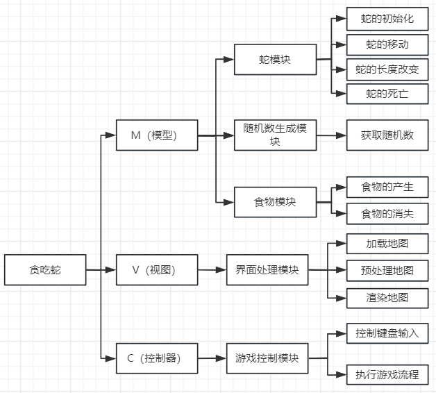
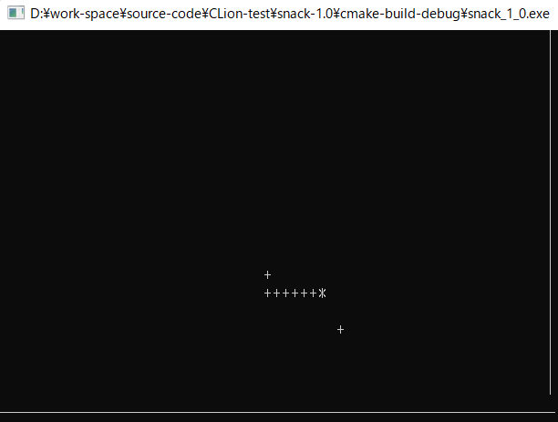
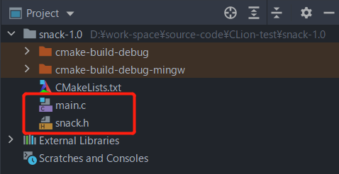

# 综合项目-贪吃蛇1.0版
## 1) 程序分析
>相信大家都知道贪吃蛇这款游戏，它是一款经典的手机游戏。
>
>通过控制蛇头方向吃食物，使得蛇变长，从而获得积分，既简单又耐玩。
>
>通过上下左右键控制蛇的方向，寻找吃的东西，每吃一口就能得到一定的积分，而且蛇的身子会越吃越长，身子越长玩的难度就越大，不能碰墙，不能咬到自己身体，更不能咬自己的尾巴，等到了一定的分数，就能过关，然后继续玩下一关。
### 1-1) 模块设计
> 在本游戏中，从键盘输入来获取移动方向和蛇的移动的关系（详见以下模块设计图。



### 1-2) 模块描述
#### 定义蛇对象
```c
/* 定义蛇的身体（单个）对象 */
struct Body {
  int x;  // 横坐标
  int y;  // 纵坐标
};

/* 定义蛇对象 */
struct Snack {
  // 蛇身（其中bodies[0]代表蛇头
  struct Body bodies[WIDTH * HEIGHT];
  // 蛇的大小
  int size;
} snack;  // 一个蛇变量
```
##### 蛇的初始化
>蛇的初始化实际就是二维数组的初始化，该二维数组存储2个值，里面包含蛇身体的坐标信息；
>
>规定它出现的初始位置是横纵坐标的中间。
##### 蛇的移动
>蛇的移动是通过改变二位数组坐标位置来实现的；
>
>例如，当蛇向右前进一个单位，则将尾每一个身体位置的坐标更改，同时改变蛇头、蛇身和蛇尾的方向（整体看来蛇就前进了一个单位。
##### 蛇的增长
>当蛇吃了正常食物后，蛇的长度会增加，增加蛇的长度就是在食物的位置增加一个二维数组并且将这个位置变为蛇头。
##### 蛇的死亡
>当蛇撞上障碍物、自身或者通关时，蛇会死亡（蛇死亡就是二维数组的销毁。
#### 定义食物对象
```c
/* 定义食物对象 */
struct Food {
  int x;  // 横坐标
  int y;  // 纵坐标
} food;   // 一个食物变量
```
##### 食物的产生
>食物出现的位置产生都是随机的，这些因素由通过随机函数获取的随机数决定；注意食物的位置不能出现在障碍物和边界上。
#### 图形界面
>加载游戏的图形界面
#### 控制流程
>1> 蛇头和墙壁的碰撞
>
>2> 蛇头和蛇身体的碰撞
>
>3> 蛇头和食物的碰撞
>
>  3-1> 蛇身的增长
>
>  3-2> 食物消失 --> 新食物产生
>
>  3-3> 分数累加
>
>  3-4> 移动速度增大
>
>4> 蛇的移动
>
>  4-1> 自动移动
>
>  4-2> 手动控制移动：ASWD --> 左下上右
>
>5> 显示分数（排行榜
### 1-3) 项目分析
>游戏界面显示之后，会根据读取的移动方向来控制蛇的移动，蛇移动之后会吃食物，食物被吃掉之后又会随机生成，然后刷新界面，将界面显示出来。
>
>刷新界面时会判断蛇的状态，如果蛇死亡，则结束游戏；如果蛇胜利晋级进入下一关，重新加载地图，显示新的一关的游戏初始界面；如果蛇没有死亡也没有晋级过关，继续本关游戏，则按照读取的键盘输入控制蛇的移动。
## 2) 项目实现
### 2-1) 效果展示


### 2-2) 项目实现
#### 项目结构


#### 源码一览
```c
#include "snack.h"

int main() {
  /* 设置光标为非可见（去除光标 */
  CONSOLE_CURSOR_INFO cci = {sizeof(cci), FALSE};
  SetConsoleCursorInfo(GetStdHandle(STD_OUTPUT_HANDLE), &cci);
  /* 播种随机数种子 */
  srand(time(NULL));
  /* 定义控制光标的结构体变量 并初始化 */
  COORD coord = {0};

  /* 初始化蛇 */
  InitSnack();
  /* 初始化食物 */
  InitFood();
  /* 画边界墙 */
  InitWall();
  /* 初始化界面 */
  InitUI(&coord);

  /* 玩游戏 */
  PlayGame(&coord);

  /* 展示游戏分数 */
  ShowScore(&coord);

  system("pause");
  return EXIT_SUCCESS;
}

/**
 * 玩游戏
 * @param coord
 */
void PlayGame(COORD *coord) {
  char key = 'd';
  /* 判断贪吃蛇是否已经撞墙 */
  // 注意[0, 0] 不是原点
  while (snack.bodies[0].x >= 0 && snack.bodies[0].x < WIDTH
    && snack.bodies[0].y >= 0 && snack.bodies[0].y < HEIGHT) {
    // 重新渲染界面
    InitUI(coord);

    // 接受用户的输入
    if (_kbhit()) {  // 为“真”时代表用户敲击了键盘
      key = (char) _getch();
    }

    // 通过分析发现 控制上下左右的按键会触发坐标的更改
    switch (key) {
      case 'w':   // 上移 (0, -1)
        input.x = 0;
        input.y = -1;
        break;
      case 'a':   // 左移 (-1, 0)
        input.x = -1;
        input.y = 0;
        break;
      case 's':   // 下移 (0, +1)
        input.x = 0;
        input.y = 1;
        break;
      case 'd':   // 右移 (+1, 0)
        input.x = 1;
        input.y = 0;
        break;
      default:    // 无效按键
        break;
    }

    // 判断蛇头是否撞身体（看蛇头的坐标是否和任意一节身体的坐标完全一致
    for (int i = 1; i < snack.size; i++) {
      if (snack.bodies[0].x == snack.bodies[i].x
          && snack.bodies[0].y == snack.bodies[i].y) {
        return; // 提前终止游戏
      }
    }

    // 判断蛇头是否撞上食物
    if (snack.bodies[0].x == food.x && snack.bodies[0].y == food.y) {
      InitFood();   // 重新生成食物
      snack.size++; // 蛇身体增长
      score++;      // 加分
      // 加速
      sleepSecond -= 10;
    }

    /* 移动蛇之前记住当前的尾部 用户下次清空 */
    lastX = snack.bodies[snack.size - 1].x;
    lastY = snack.bodies[snack.size - 1].y;

    /* 移动蛇 */
    // 通过分析得知：让蛇的身体的前一节来覆盖当前节 并让蛇头按照用户按键输入变化即可
    for (int i = snack.size - 1; i > 0; i--) {
      snack.bodies[i].x = snack.bodies[i - 1].x;
      snack.bodies[i].y = snack.bodies[i - 1].y;
    }
    snack.bodies[0].x += input.x;
    snack.bodies[0].y += input.y;

    Sleep(sleepSecond);
  }
}

/**
 * 展示游戏分数
 * @param coord
 */
void ShowScore(COORD *coord) {
  // 将光标移出游戏界面（让其不干扰游戏
  (*coord).X = 0;
  (*coord).Y = HEIGHT + 2;
  SetConsoleCursorPosition(GetStdHandle(STD_OUTPUT_HANDLE), *coord);

  printf("Game Over!!!\n");
  printf("Your score is %d\n\n\n", score);
}

/*
 * 初始化蛇 默认2节身体（头朝右
 */
void InitSnack(void) {
  snack.size = 3;
  // 初始化蛇头和蛇身
  for (int i = 0; i < snack.size; i++) {
    snack.bodies[i].x = WIDTH / 2 - i;
    snack.bodies[i].y = HEIGHT / 2;
  }
}

/**
 * 初始化食物
 */
void InitFood(void) {
  // 随机横坐标：0-59
  food.x = rand() % WIDTH;
  // 随机纵坐标：0-19
  food.y = rand() % HEIGHT;
}

/**
 * 初始化边界墙
 */
void InitWall(void) {
  for (int i = 0; i <= HEIGHT; i++) {
    for (int j = 0; j <= WIDTH; j++) {
      if (i == HEIGHT) {
        printf("_");
      } else if (j == WIDTH) {
        printf("|");
      } else {
        printf(" ");
      }
    }
    printf("\n");
  }
}

/**
 * 初始化界面（蛇和食物）
 * @param coord
 */
void InitUI(COORD *coord) {
  // 画出蛇和食物
  DrawSnack(coord);
  DrawFood(coord);
}

void DrawSnack(COORD *coord) {
  // 画出蛇头和蛇身
  for (int i = 0; i < snack.size; i++) {
    (*coord).X = (short) snack.bodies[i].x;
    (*coord).Y = (short) snack.bodies[i].y;
    SetConsoleCursorPosition(GetStdHandle(STD_OUTPUT_HANDLE), *coord);
    if (i == 0) {
      putchar('*');
    } else {
      putchar('+');
    }
  }

  // 去除前回蛇尾
  (*coord).X = (short ) lastX;
  (*coord).Y = (short ) lastY;
  SetConsoleCursorPosition(GetStdHandle(STD_OUTPUT_HANDLE), *coord);
  putchar(' ');
}

void DrawFood(COORD *coord) {
  // 画出食物
  (*coord).X = (short) food.x;
  (*coord).Y = (short) food.y;
  SetConsoleCursorPosition(GetStdHandle(STD_OUTPUT_HANDLE), *coord);
  putchar('+');
}
```
```c
// 条件编译 用于防止预编译阶段引入的头文件内容重复
#ifndef SNACK_1_0__SNACK_H_
#define SNACK_1_0__SNACK_H_

#include <stdio.h>
#include <string.h>
#include <stdlib.h>
#include <math.h>
#include <time.h>
#include <conio.h>
#include <Windows.h>

/* 定义游戏面板的宽度和高度 */
#define WIDTH 60
#define HEIGHT 20

/* 定义蛇的身体（单个）对象 */
struct Body {
  int x;  // 横坐标
  int y;  // 纵坐标
};

/** 蛇和食物、分数等都只要一份就可以了 所以可以直接的定义结构体的同时 顺便定义变量 */
/* 定义蛇对象 */
struct Snack {
  // 蛇身（其中bodies[0]代表蛇头
  struct Body bodies[WIDTH * HEIGHT];
  // 蛇的大小
  int size;
} snack;  // 一个蛇变量

/* 定义食物对象 */
struct Food {
  int x;  // 横坐标
  int y;  // 纵坐标
} food;   // 一个食物变量

/* 游戏分数 */
int score = 0;

/* 控制画面刷新速度 */
int sleepSecond = 400;

/* 用户按键的输入 */
struct Key {
  int x;
  int y;
} input;

/* 记录蛇移动时 直前状态的尾部 */
int lastX = 0;
int lastY = 0;

/* 初始化蛇 默认1节身体（头朝右 */
void InitSnack(void);

/* 初始化食物 */
void InitFood(void);
/* 初始化围墙 */
void InitWall(void);

/* 初始化界面（画蛇和食物） */
void InitUI(COORD *coord);
void DrawSnack(COORD *coord);
void DrawFood(COORD *coord);

/* 玩游戏 */
void PlayGame(COORD *coord);
/* 展示游戏分数 */
void ShowScore(COORD *coord);

#endif //SNACK_1_0__SNACK_H_
```
## 3) 拓展训练
### 3-1) 函数
#### SetConsoleCursorPosition
>`BOOL` ==SetConsoleCursorPosition==(`HANDLE` handle, `COORD` coord);
>
>👉 用来定位控制台光标位置，需要引入头文件`Windows.h`
>
><u>`参数含义`</u>
>
>`handle`: 一般用默认的`GetStdHandle`(STD_OUTPUT_HANDLE)来获取标准输出的句柄（了解即可）
>
>`coord`: 是windows API中定义的一种结构体，用来表示一个字符在控制台中的坐标
```c
typedef struct _COORD {
  SHORT X;
  SHORT Y;
} COORD
```
#### kbhit
>`int` ==_kbhit==(`void`);
>
>👉 检查当前是否有键盘输入，若有则返回一个非0值，否则返回0（达到`非阻塞输入`的效果）；需要引入头文件`conio.h`
```c
if (_kbhit()) {
  ...
}
```
#### getch
>`int` ==_getch==(`void`);
>
>👉 从控制台读取一个字符，但不显示在屏幕上（达到`无回显`的效果）；需要引入头文件`conio.h`
```c
// 返回字符ASCII码
char key = _getch();
```
#### SetConsoleCursorInfo
>`BOOL` ==SetConsoleCursorInfo==(`HANDLE` handle, `CONST CONSOLE_CURSOR_INFO*` cci);
>
>👉 是用来检索有关指定控制台屏幕缓冲区的光标大小和可见性的信息，需要引入头文件`Windows.h`
>
><u>`参数含义`</u>
>
>`handle`: 一般用默认的`GetStdHandle`(STD_OUTPUT_HANDLE)来获取标准输出的句柄（了解即可）
>
>`cci`: 是windows API中定义的一种结构体，用来描述终端光标信息
```c
typedef struct _CONSOLE_CURSOR_INFO {
  DWORD dwSize;    // 光标大小（模式设置 sizeof(cci) 即可
  BOOL bVisible;   // 光标可见（FALSE: 不可见
} CONSOLE_CURSOR_INFO;
```